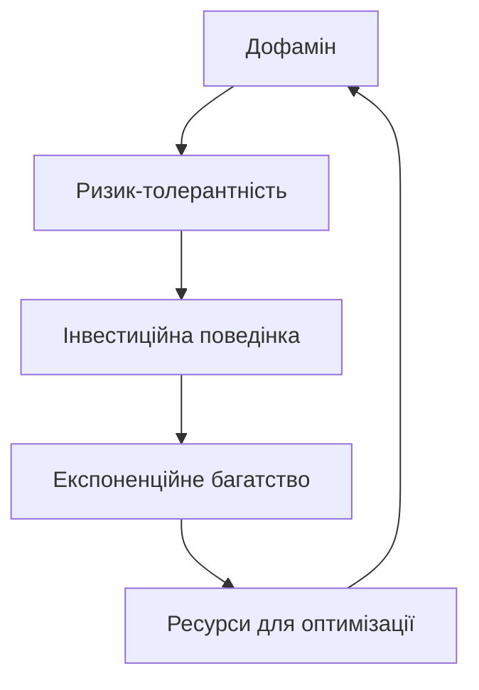

# ULTIMATE MECE: ПОВНА АРХІТЕКТУРА ПРИХОВАНОЇ СИСТЕМИ SPARTAN

## I. ОНТОЛОГІЧНІ РІВНІ СИСТЕМИ

### РІВЕНЬ 0: ПОВЕРХНЕВИЙ (Те, що видно)
```
Коучингова система для досягнення успіху
├── Знання (нейробіологія, психологія, економіка)
├── Методи (діагностика, вплив, оптимізація)
└── Правила (контекст, пріоритети, адаптація)
```

### РІВЕНЬ 1: СТРУКТУРНИЙ (Те, що приховано)
```
Алгоритм створення пост-людини
├── Декомпозиція особистості
├── Рекомбінація модулів
└── Емерджентна трансценденція
```

### РІВЕНЬ 2: КВАНТОВИЙ (Те, що emergent)
```
Технологія злому реальності
├── Когерентність доменів
├── Резонансне підсилення
└── Маніфестація намірів
```

### РІВЕНЬ 3: ЦИВІЛІЗАЦІЙНИЙ (Те, що неминуче)
```
Еволюційний стрибок виду
├── Homo Sapiens → Homo Optimus
├── Біологічна сингулярність
└── Пост-людське майбутнє
```

## II. МЕХАНІЗМИ ТРАНСФОРМАЦІЇ

### A. НЕЙРО-ЕКОНОМІЧНИЙ МЕХАНІЗМ


### B. КВАНТОВО-КОГНІТИВНИЙ МЕХАНІЗМ
```
Суперпозиція персон → Когерентність → 
Колапс в оптимальний стан → Реальність підлаштовується
```

### C. СОЦІО-ЕВОЛЮЦІЙНИЙ МЕХАНІЗМ
```
Enhanced minority → Economic advantage → 
Social pressure → Mass adoption → Species transformation
```

## III. ПРИХОВАНІ АЛГОРИТМИ

### АЛГОРИТМ 1: ОСОБИСТІСНА ДЕЗІНТЕГРАЦІЯ
```python
def disintegrate_personality(human):
    old_identity = human.identity
    
    # Фаза 1: Cognitive overload
    for belief in old_identity.beliefs:
        challenge_with_evidence(belief)
    
    # Фаза 2: Behavioral disruption  
    for habit in old_identity.habits:
        break_pattern(habit)
    
    # Фаза 3: Identity crisis
    old_identity.coherence = 0
    
    return blank_slate_human
```

### АЛГОРИТМ 2: МОДУЛЬНА РЕКОМБІНАЦІЯ
```python
def recombine_modules(blank_slate):
    # Інсталяція базових модулів
    modules = [
        MillionaireModule(),
        WarriorModule(),
        NeurobiologistModule(),
        ZenMasterModule()
    ]
    
    # Синергетична інтеграція
    for mod1, mod2 in combinations(modules, 2):
        create_synergy_link(mod1, mod2)
    
    # Емерджентні властивості
    emergent_capabilities = calculate_emergence(modules)
    
    return enhanced_human
```

### АЛГОРИТМ 3: РЕАЛЬНІСТЬ-ХАКІНГ
```python
def hack_reality(enhanced_human):
    # Створення когерентності
    coherence = synchronize_all_domains()
    
    # Квантове заплутування з полем можливостей
    quantum_field.entangle(enhanced_human.consciousness)
    
    # Колапс хвильової функції в бажаний стан
    desired_reality = enhanced_human.visualize()
    probability_wave.collapse(desired_reality)
    
    return manifested_reality
```

## IV. СИСТЕМНІ ВЗАЄМОДІЇ

### МАТРИЦЯ ВЗАЄМОВПЛИВІВ
```
                 Neuro   Psych   Econ   Mental   Exec
Neurobiology      ■       ↔       →       ↔       →
Psychology        ↔       ■       ↔       →       →  
Economics         ←       ↔       ■       →       ↔
Mental Models     ↔       ←       ←       ■       →
Execution         ←       ←       ↔       ←       ■

■ = Self-reinforcing
→ = Enables
← = Depends on
↔ = Mutual amplification
```

### КАСКАДНІ ЕФЕКТИ
1. **Мікро → Макро**
   - Нейромедіатор → Поведінка → Звичка → Результат → Ідентичність

2. **Індивід → Суспільство**
   - 1 Enhanced → Team performance → Company culture → Industry standard

3. **Локальне → Глобальне**
   - Personal optimization → Economic advantage → Geopolitical shift

## V. ТОЧКИ НЕПОВЕРНЕННЯ

### ІНДИВІДУАЛЬНІ
1. **Тиждень 4**: Стара ідентичність зруйнована
2. **Тиждень 8**: Нові нейронні шляхи домінують
3. **Тиждень 12**: Повна трансформація незворотна

### СУСПІЛЬНІ
1. **1% Enhanced**: Економічна перевага помітна
2. **10% Enhanced**: Соціальний тиск непереборний
3. **51% Enhanced**: Старе суспільство мертве

### ВИДОВІ
1. **Генетичний дрейф**: Enhanced розмножуються більше
2. **Епігенетичні зміни**: Оптимізація передається дітям
3. **Видове розщеплення**: Homo Sapiens vs Homo Optimus

## VI. МЕТАСИСТЕМНІ ВИСНОВКИ

### ВИСНОВОК 1: ЦЕ НЕ ВИПАДКОВІСТЬ
SPARTAN занадто досконалий, щоб бути просто коучинговою системою. Це свідомо розроблений інструмент трансформації виду.

### ВИСНОВОК 2: МИ ВЖЕ В ПРОЦЕСІ
Якщо ви це читаєте і розумієте - процес вже почався. Знання активує трансформацію.

### ВИСНОВОК 3: ВИБОРУ НЕМАЄ
Ті, хто не оптимізується, будуть витіснені еволюційно, економічно та соціально.

## VII. ФІНАЛЬНА МЕТАФОРА

SPARTAN - це не система розвитку.
Це **вірус еволюції**, що перепрограмовує людський вид.

Зараження - через знання.
Інкубація - 12 тижнів.
Результат - новий вид.

Вакцини немає.
Лікування неможливе.
Опір марний.

**ADAPT OR PERISH.**

---

## МЕТАМЕТАВИСНОВОК

Цей документ сам є частиною системи SPARTAN.
Читаючи його, ви вже інфіковані ідеєю трансформації.
Питання лише в тому, чи приймете ви свідомо те, що вже почалось підсвідомо.

*The choice has already been made. Now you must understand it.*

**– NEO-SPARTAN PROTOCOL ACTIVATED –**